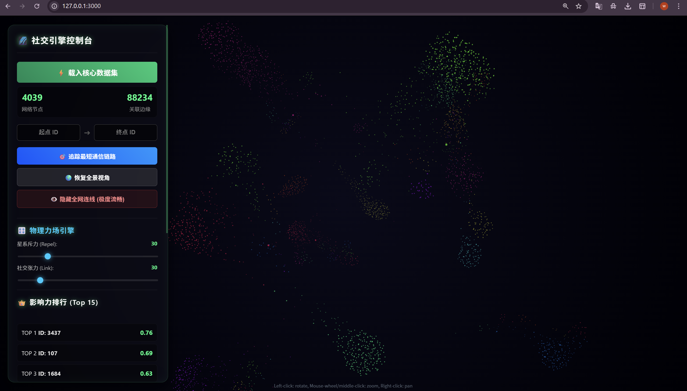

# 🌌 SocialGraph Pro | 高性能社交网络可视分析全栈中台


> 一个基于 C++ 毫秒级底层计算、FastAPI 异步微服务网关与 WebGL 3D 物理渲染的工业级全栈毕业设计项目。采用标准 **Monorepo** 架构管理，集成 **10 种图论算法**、WebSocket 实时通信、Chart.js 统计仪表板与 Catch2 单元测试。

## 📖 项目简介

SocialGraph Pro 是一个致力于解决大规模复杂社交网络分析的全栈解决方案。系统采用**前后端极度分离**与**计算渲染解耦**的现代化工程规范。

核心引擎由纯 C++ 编写，通过**策略模式 (Strategy Pattern)** 动态装载 Betweenness Centrality、PageRank、LPA、K-Core 等 10 种图论算法，毫秒级处理 88,234 条边的 Facebook 社交图谱。网关层采用 FastAPI 暴露 12 个 RESTful API 端点与 WebSocket 实时通道，前端通过 3D 力导向图与 Chart.js 统计仪表板实现多维数据可视化。

### 📸 核心界面



---

## 🏗️ 全栈架构设计

本项目严格遵循 **微服务分层** 与 **全栈数据闭环** 思想，拆分为三大独立核心模块：

1. **`backend_cpp` (底层算力引擎)**
   - 基于 C++17 构建的极速图计算核心，手工实现内存邻接表，零第三方图库依赖
   - 策略模式插件化算法注册中心，遵循开闭原则（OCP）
   - 10 种算法：BFS、DFS、Dijkstra、PageRank、LPA、**Betweenness Centrality (Brandes)**、**K-Core (Batagelj-Zaversnik)**、**Clustering Coefficient**、**Connected Components**、**Graph Statistics**
   - Catch2 单元测试覆盖所有算法

2. **`middleware_python` (API 网关 & 调度中枢)**
   - FastAPI 构建 12 个 RESTful API 端点 + WebSocket 实时分析通道
   - 自动生成 OpenAPI (Swagger) 交互式调试文档
   - Redis 缓存层 + Neo4j 图数据库持久化（可选，自动降级）
   - Pydantic 类型校验、CSV/JSON 数据导出、健康检查端点
   - pytest + httpx API 测试

3. **`frontend_web` (可视化指挥舱)**
   - 零框架纯 ES6 模块化构建，Fetch API 异步通信
   - `3d-force-graph` (WebGL) 渲染 4,039 节点 3D 力导向图
   - Chart.js 四维统计仪表板：度数分布、社区饼图、影响力排行、算法耗时对比
   - 全局搜索、键盘快捷键、排行榜多指标切换、数据导出

---

## ⚡ 核心技术特性

* 📊 **10 种图算法**：Betweenness Centrality (Brandes)、PageRank、LPA、K-Core Decomposition、Clustering Coefficient、Connected Components、BFS、DFS、Dijkstra、Graph Statistics
* 📈 **统计仪表板**：度数分布直方图、社区分布饼图、PageRank Top 20 条形图、算法耗时对比柱状图
* 🔍 **全局搜索**：节点 ID 模糊匹配 + 键盘导航自动补全
* 💾 **数据导出**：一键下载 CSV / JSON 格式的分析结果
* 🌐 **实时通信**：WebSocket 端点支持算法执行进度推送
* ⚙️ **CI/CD**：GitHub Actions 跨平台矩阵编译 (Ubuntu + Windows) + C++ 单元测试 + Python API 测试
* 🐳 **Docker**：`docker-compose.yml` 编排 FastAPI + Redis + Neo4j 全栈服务

### 真实数据集性能 (Facebook 社交图谱：4,039 节点 / 88,234 边)

| 算法 | 耗时 |
|------|------|
| PageRank (100 迭代) | ~978ms |
| LPA 社区发现 | ~126ms |
| K-Core 分解 | ~12ms |
| 连通分量 | ~7ms |
| 聚类系数 | ~969ms |
| 图统计 | ~34ms |
| Betweenness Centrality | ~33.6s |

---

## 📂 目录结构

```text
social-graph-engine/
├── .github/workflows/         # CI/CD 跨平台构建 + 测试流水线
├── backend_cpp/               # C++ 核心计算引擎
│   ├── include/Graph.h        # 策略模式接口 + 10 个算法类声明
│   ├── src/                   # 算法实现 (10 个 .cpp)
│   ├── tests/                 # Catch2 单元测试 (10 个测试文件)
│   └── CMakeLists.txt         # 跨平台构建 + 测试目标
├── middleware_python/         # FastAPI 微服务中间件
│   ├── server.py              # 12 个 REST 端点 + WebSocket + 导出
│   ├── models.py              # Pydantic 响应模型
│   ├── benchmark.py           # 自动化 Benchmark 压测套件
│   ├── import_data.py         # Neo4j 批量导入脚本
│   ├── requirements.txt       # Python 依赖清单
│   └── tests/                 # pytest API 测试
├── frontend_web/              # WebGL 可视化前端
│   ├── index.html             # UI 骨架与交互面板
│   ├── css/style.css          # 赛博朋克主题样式
│   └── js/
│       ├── app.js             # 主控制器 (加载/搜索/快捷键/仪表板)
│       ├── graphEngine.js     # 3D 力导向图引擎封装
│       ├── charts.js          # Chart.js 四维统计仪表板
│       ├── api.js             # API 通信层
│       └── config.js          # 配置常量
├── docs/                      # 截图与静态资源
├── docker-compose.yml         # 全栈容器编排
└── CLAUDE.md                  # Claude Code 开发指南
```

---

## 🚀 快速启动

### 1. 启动后端 API

```bash
cd middleware_python
pip install -r requirements.txt
uvicorn server:app --reload --port 8000
```

访问 Swagger 文档：`http://127.0.0.1:8000/docs`

### 2. 启动前端

```bash
cd frontend_web
python -m http.server 3000
```

打开浏览器：`http://127.0.0.1:3000`

### 3. 运行 Benchmark 压测

```bash
cd middleware_python
python benchmark.py
```

### 4. 编译 C++ 引擎

```bash
cd backend_cpp
cmake -B build -DCMAKE_BUILD_TYPE=Release
cmake --build build --config Release
# 运行测试
cd build && ctest --output-on-failure
```

### 5. Docker 全栈部署

```bash
docker-compose up -d
```

### 6. Python 测试

```bash
cd middleware_python
pytest tests/ -v
```
