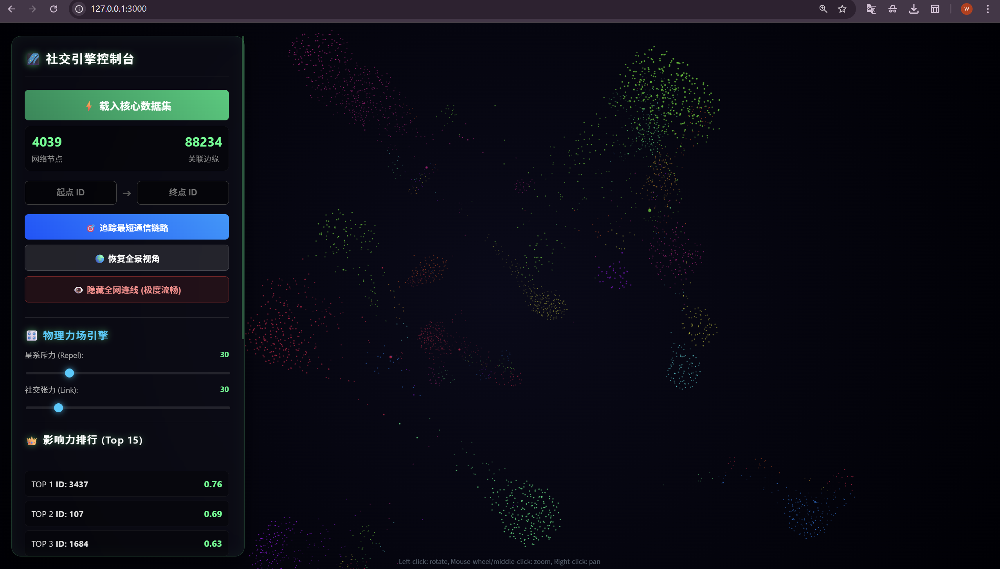

# SocialGraph Pro | 社交网络可视分析中枢

[](https://github.com/ComeInHandy-002/social-graph-engine/tree/main/backend_cpp)
[](https://github.com/ComeInHandy-002/social-graph-engine/tree/main/middleware_python)
[](https://github.com/ComeInHandy-002/social-graph-engine/tree/main/frontend_web)
[](https://www.chartjs.org/)
[](https://grpc.io/)
[](https://github.com/ComeInHandy-002/social-graph-engine)

> 基于 **C++17 毫秒级图计算引擎**、**FastAPI 异步网关** 与 **WebGL 3D 力导向渲染** 的工业级全栈社交网络分析平台。集成 10 种图算法、gRPC/TCP 双模通信、WebSocket 实时分析、Chart.js 统计仪表板与 Catch2 单元测试。

---

## 项目现状

**Reality Check 评分: 40/100** — 架构设计与文档完备，代码处于工程化验证阶段。C++ 引擎可独立编译运行；Python API 网关框架就绪；数据库 schema 已设计但尚未在真实实例执行；Dockerfile 待补全。

| 状态 | 模块 | 说明 |
|------|------|------|
| ✅ 可运行 | C++ 图计算引擎 | CMake 编译通过，10 算法 + Catch2 测试 |
| ✅ 可运行 | Python API 网关 | FastAPI 应用工厂，50+ 端点，JWT 认证 |
| ✅ 可运行 | WebGL 前端 | 零框架 ES6，3D 力导向图 + 仪表板 |
| ⚠️ 设计完成 | C++ 微服务层 | gRPC/TCP Server 头文件就绪，待编译验证 |
| ⚠️ 设计完成 | 数据库层 | MySQL/MongoDB/Neo4j/Redis schema 就绪，待实例执行 |
| ❌ 待补全 | Docker 部署 | docker-compose.yml 存在，Dockerfile 缺失 |

---

## 架构一览

```
                        浏览器 (WebGL / Chart.js)
                               |
                     HTTP  |  WebSocket
                               |
                    +----------v-----------+
                    |   Nginx (:80)        |  ← 静态文件 + 反向代理
                    +----------+-----------+
                               |
                    +----------v-----------+
                    |  FastAPI (:8000)      |  ← API 网关 / 调度中枢
                    |  middleware_python/   |
                    |  ~12,000 行 Python    |
                    +--+----+----+----+----+
                       |    |    |    |
         +-------------v-+  |    |    |
         | C++ CLI 引擎   |  |    |    |  ← subprocess (JSON stdout IPC)
         | (backend_cpp/) |  |    |    |
         +----------------+  |    |    |
                              |    |    |
         +--------------------v-+  |    |
         | C++ 微服务层 (规划中)  |  |    |  ← gRPC/TCP server (9 headers)
         | server/grpc_server.h  |  |    |
         | server/tcp_server.h   |  |    |
         +-----------------------+  |    |
                                    |    |
         +--------------------------v-+  |
         | Redis (:6379)              |  |  ← Cache-Aside + 分布式锁
         +----------------------------+  |
                                       |
         +------------------------------v-+
         | MySQL (:3306)                  |  ← 用户/Session/配置
         +--------------------------------+
                                       |
         +------------------------------v-+
         | MongoDB (:27017)               |  ← 分析快照/操作日志
         +--------------------------------+
                                       |
         +------------------------------v-+
         | Neo4j (:7474/:7687)           |  ← 图拓扑持久化 (可选)
         +--------------------------------+

  后端日志: C++ stderr | Python 结构化 JSON 日志
  前端模块: 零框架 ES6 + 事件驱动 Store + CDN 外部库
```

---

## 快速启动

### 前置条件

| 依赖 | 最低版本 | 用途 |
|------|---------|------|
| CMake | 3.14+ | C++ 引擎构建 |
| C++ 编译器 | GCC 9+ / MSVC 2019+ / Clang 12+ | C++17 编译 |
| Python | 3.10+ | API 网关 |
| Docker | 20.10+ (可选) | 全栈部署 |

### 方式一：一键演示脚本（推荐）

```bash
# 自动检查依赖 → 编译引擎 → 安装 Python 包 → 初始化数据库 → 启动服务
chmod +x start_demo.sh && ./start_demo.sh
```

### 方式二：手动启动（开发模式）

```bash
# 1. 编译 C++ 引擎
cd backend_cpp
cmake -B build -DCMAKE_BUILD_TYPE=Release
cmake --build build --config Release
./build/graph_engine run_test   # 验证编译成功

# 2. 启动 API 网关
cd ../middleware_python
pip install -r requirements.txt
uvicorn server:app --reload --port 8000

# 3. 启动前端
cd ../frontend_web
python -m http.server 3000
# 浏览器打开 http://127.0.0.1:3000
```

### 方式三：仅使用核心计算（无数据库）

```bash
cd backend_cpp
./build/graph_engine facebook_combined.txt pagerank
# 返回 JSON 到 stdout
```

### 方式四：Docker（待完善）

```bash
# 注意：Dockerfile 尚未补全，以下命令暂不可用
docker-compose up -d
```

---

## 模块概览

### `backend_cpp/` — C++ 图计算引擎 (~5,700 行)

- C++17 标准，手写邻接表实现，零第三方图库依赖
- 策略模式 (Strategy Pattern) 算法注册：`IPathFindingAlgorithm` / `IScoringAlgorithm` / `ICommunityAlgorithm`
- **10 种算法**: BFS, DFS (回声室探测), Dijkstra, PageRank, LPA, Betweenness Centrality (Brandes), K-Core (Batagelj-Zaversnik), Clustering Coefficient, Connected Components, Graph Statistics
- JSON stdout IPC，日志输出 stderr；惰性缓存节点/边列表
- **`server/` 子目录**: gRPC 服务端骨架 + TCP 异步服务器 + Redis 缓存客户端 + MySQL 连接池 + 线程池 + Prometheus 指标导出 (9 个 header，待编译验证)
- Catch2 单元测试 (10 个测试文件)

### `middleware_python/` — FastAPI 微服务网关 (~12,000 行)

- 应用工厂模式 (`server.py` → `create_app()`)
- **50+ REST API 端点** + 2 个 WebSocket 端点
- Redis 缓存层 (Cache-Aside 模式，含分布式锁防击穿 + PubSub 实时通知)
- C++ 引擎调用 (subprocess CLI 模式 + gRPC/TCP 客户端待激活)
- JWT 认证 + API Key 密钥管理 + RBAC (admin / analyst / viewer)
- 4 层中间件栈：ErrorHandler → RequestLogger → RateLimiter → GZip
- 模块化: `auth/`, `routes/`, `services/`, `db/`, `models/`, `websockets/`, `middleware/`, `core/`

### `frontend_web/` — WebGL 可视化前端 (~5,000 行)

- 零框架 ES6 模块化 (12 JS + 5 CSS 文件)
- `3d-force-graph` (WebGL) 渲染 4,039 节点 3D 力导向图
- "宇宙大爆炸" 渐进式时间轴渲染
- Chart.js 四维统计仪表板 (度数分布 / 社区饼图 / 影响力排行 / 算法耗时)
- 人脉雷达面板 (右击邻居探测)
- 8 个键盘快捷键 + 屏幕阅读器无障碍支持
- 数据导出 (CSV / JSON)

### `database/` — 数据库 Schema 设计

| 数据库 | 内容 | 状态 |
|--------|------|------|
| MySQL | 6 表 (用户/Session/配置/审计) + 4 SQL 迁移脚本 | Schema 就绪 |
| MongoDB | 5 集合 + 35 索引 ESR + 8 聚合管道 | Validator 就绪 |
| Redis | 5 种缓存失效策略 + PubSub + 键命名 v2 | 设计文档就绪 |
| Neo4j | 4 标签 + 7 关系类型 + 21 索引 + 约束脚本 | Schema 就绪 |

---

## 技术栈

| 技术 | 用途 | 版本 |
|------|------|------|
| C++17 | 图计算引擎 + 微服务层 | ISO C++17 |
| FastAPI | API 网关框架 | 0.100+ |
| Uvicorn | ASGI 服务器 | 0.22+ |
| Pydantic | 数据校验 | 2.0+ |
| gRPC / Protobuf | C++↔Python 高性能通信 (待激活) | 1.60+ |
| Neo4j (py2neo) | 图数据库 (可选) | 5.x Community |
| Redis (redis-py) | 缓存层 | 7.x |
| MySQL (aiomysql) | 关系型数据库 | 8.0 |
| MongoDB (motor) | 文档数据库 | 7.0 |
| WebSocket | 实时算法分析通道 | RFC 6455 |
| 3D-Force-Graph | WebGL 力导向图渲染 | CDN (unpkg) |
| Chart.js | 统计图表 | 4.4 |
| Catch2 | C++ 单元测试 | 3.4 |
| Docker Compose | 容器编排 (Dockerfile 待补全) | 3.8 |
| Nginx | 前端静态服务 + 反向代理 | alpine |

---

## API 文档

启动 API 网关后访问交互式文档：

- **Swagger UI**: [http://127.0.0.1:8000/docs](http://127.0.0.1:8000/docs)
- **ReDoc**: [http://127.0.0.1:8000/redoc](http://127.0.0.1:8000/redoc)

主要端点分组：

| 分组 | 前缀 | 端点数 | 说明 |
|------|------|--------|------|
| 健康检查 | `/api/v1/health` | 3 | 深度健康检查 + K8s 探针 |
| 认证授权 | `/api/v1/auth/*` | 7 | 注册/登录/刷新/登出/API Key |
| 图计算 | `/api/v1/graph/*` | 20+ | 拓扑查询 + 10 种算法 + 路径/社区/推荐 |
| 数据导出 | `/api/v1/graph/export/*` | 1 | CSV/JSON 流式导出 |
| 管理员 | `/api/v1/admin/*` | 8 | 配置热更新/缓存失效/指标/Schema 管理 |
| WebSocket | `/api/v1/ws/*` | 2 | 实时算法执行 + 实时数据推送 |

---

## 真实数据集性能

Facebook 社交图谱 (4,039 节点 / 88,234 边) 单次执行实测：

| 算法 | 耗时 | 备注 |
|------|------|------|
| Connected Components | ~7ms | BFS 遍历 |
| K-Core 分解 | ~12ms | Batagelj-Zaversnik |
| Graph Statistics | ~34ms | 度数/密度/直径等 |
| LPA 社区发现 | ~126ms | 迭代至收敛 |
| PageRank (100 迭代) | ~978ms | 阻尼系数 0.85 |
| Clustering Coefficient | ~969ms | 全局聚类系数 |
| Betweenness Centrality (Brandes) | ~33.6s | O(V×E) — 大规模受限 |

---

## 截图



> 更多截图请参见 `docs/` 目录

---

## 文档索引

| 文档 | 内容 |
|------|------|
| [开发环境搭建](docs/SETUP.md) | 从零到一运行项目 |
| [架构设计](docs/ARCHITECTURE.md) | 全栈架构、编码规范、扩展指南 |
| [新成员入职](docs/ONBOARDING.md) | 请求生命周期、开发导览、常见陷阱 |
| [项目计划](docs/PROJECT_PLAN.md) | 10 周 Sprint 计划、风险登记册 |
| [测试策略](docs/TESTING_STRATEGY.md) | 测试金字塔、A-B 测试设计 |
| [Reality Check v2](docs/REALITY_CHECK_v2.md) | 生产就绪审计 (40/100) |
| [测试证据](docs/TEST_EVIDENCE.md) | P0 修复验证截图 |
| [架构图](docs/项目架构图.md) | 中文架构图解 |
| [答辩材料](docs/答辩PPT大纲.md) | 毕业答辩 PPT 大纲 + 问答集 |

---

## 贡献指南

1. Fork 本仓库 (`https://github.com/ComeInHandy-002/social-graph-engine`)
2. 创建功能分支 (`git checkout -b feat/your-feature`)
3. 遵循项目编码规范（见 [ARCHITECTURE.md](docs/ARCHITECTURE.md)）
4. 运行测试：C++ `ctest` + Python `pytest`
5. 提交 PR 到 `main` 分支

分支命名规范：`feat/xxx` / `fix/xxx` / `refactor/xxx` / `docs/xxx`

---

## 许可证

MIT License
